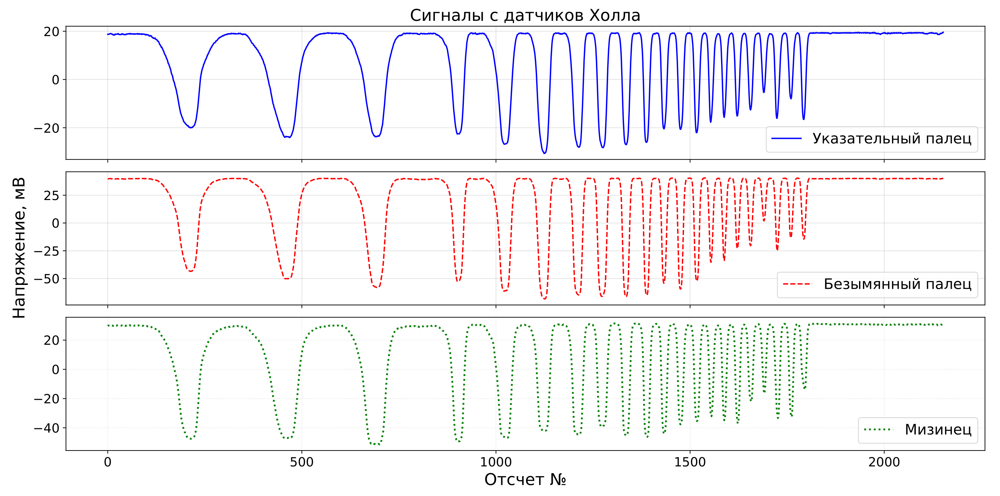
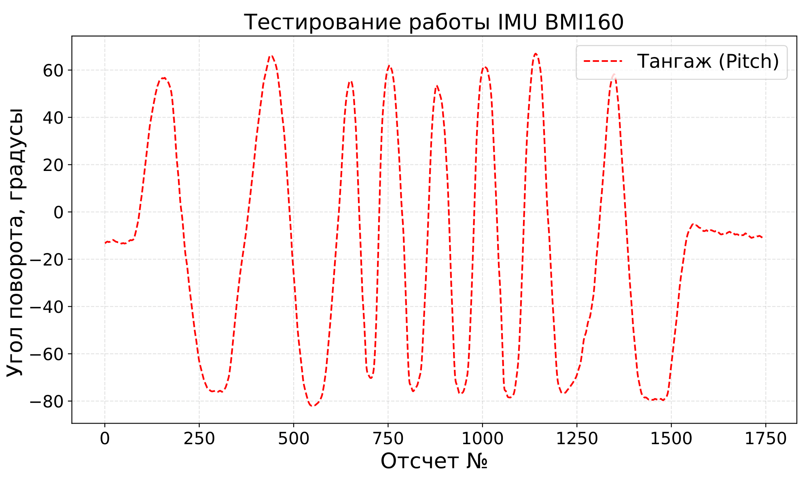
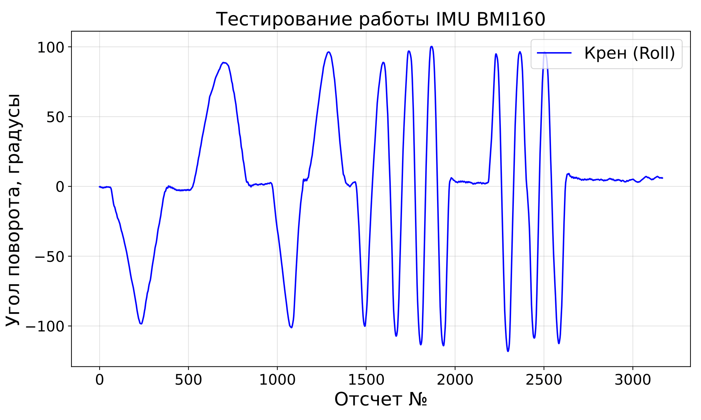

# Сенсорная перчатка для распознавания динамических жестов русского жестового языка

Разработка элементов аппаратно-программного комплекса для распознавания динамических жестов русского жестового языка (РЖЯ) на основе носимой сенсорной перчатки с последующим преобразованием распознанного жеста в аудиоречь.

Работа выполнена в рамках выпускной квалификационной работы бакалавра СПбГУ.

---

## Содержание

* [О проекте](#о-проекте)
* [Почему сенсорный подход?](#почему-сенсорный-подход)
* [Аппаратная архитектура](#аппаратная-архитектура)
* [Программное обеспечение](#программное-обеспечение)
* [Датасет](#датасет)
* [Автоматическое выделение жеста (автотриммер)](#автоматическое-выделение-жеста-автотриммер)
* [Нейросетевая модель](#нейросетевая-модель)
* [Результаты](#результаты)
* [Структура репозитория](#структура-репозитория)
* [Быстрый запуск](#быстрый-запуск)
* [Перспективы развития](#перспективы-развития)
* [Контакты](#контакты)
* [Цитирование](#цитирование)

---

# О проекте
Основная цель проекта — разработка компактного аппаратно-программного комплекса, способного распознавать динамические жесты русского жестового языка и преобразовывать их в аудиоречь в режиме, близком к реальному времени.

Мотивация — в России существует барьер между слышащими и глухими людьми (затрудняет получение образования, трудоустройство, социальную жизнь для последних), поэтому нужны автономные и устойчивые к внешним условиям системы распознавания жестов, пригодные для повседневного использования. Сейчас число исследований по распознаванию РЖЯ с использованием носимых технологий крайне ограничено.

В отличие от большинства существующих решений, использующих камеры или радиочастотные сенсоры, в данной работе выбран **носимый сенсорный подход**, основанный на сочетании линейных датчиков Холла и инерциального измерительного модуля (IMU).

Такой подход обеспечивает:

* независимость от освещения;
* устойчивость к изменению фона;
* отсутствие проблем с окклюзиями (когда одна рука перекрывает другую на кадре);
* сохранение конфиденциальности пользователя;
* возможность создания полностью автономного устройства.

---

## Почему сенсорный подход?

| Подход                              | Преимущества                                                                             | Ограничения                                                                        |
| ----------------------------------- | ---------------------------------------------------------------------------------------- | ---------------------------------------------------------------------------------- |
| Компьютерное зрение                 | Богатая информация (руки, лицо, поза), множество открытых датасетов                      | Зависимость от освещения, ракурса, фона, окклюзий, высокая вычислительная нагрузка |
| Радиочастотные системы              | Независимость от освещения, отсутствие камеры                                            | Высокий уровень шума, зависимость от окружающей среды, стационарность              |
| **Носимые сенсоры (данная работа)** | Работа в любых условиях, отсутствие окклюзий, приватность, возможность автономной работы | Необходимость ношения устройства                                                   |

---

## Аппаратная архитектура

### Основные компоненты измерительной системы

| Компонент | Назначение |
|-----------|------------|
| **5× датчиков Холла SS494B** | Измерение положения пальцев по изменению магнитного поля |
| **Неодимовый магнит N35 (40×20×4 мм)** | Создание магнитного поля для датчиков Холла |
| **Инерциальный модуль BMI160** | Измерение ускорений и угловых скоростей кисти |
| **16-битный АЦП ADS1115** | Высокоточное измерение сигналов датчиков Холла |
| **Источник опорного напряжения TL431XX** | Формирование стабильного опорного напряжения |
| **Микроконтроллер ESP32-C3 Super Mini** | Сбор данных и управление системой |

### Особенности аппаратной реализации

* датчики Холла расположены на тыльной стороне дистальных фаланг;
* магнит закреплен на тыльной стороне кисти;
* применяется псевдодифференциальное подключение ADS1115 (необходимо для использования PGA);
* используется встроенный PGA (Gain = 8);
* аналоговые RC-фильтры и фильтрация питания минимизируют шум измерительных каналов.

### Итоговые шумовые характеристики и параметры датчиков

В таблице ниже представлены шумовые характеристики датчиков в состоянии покоя. Для шумовых характеристик IMU и полученных кватернионов использовалось усреднение по осям.

| Показания с | Объем выборки | СКО | Размах |
| :--- | :--- | :--- | :--- |
| Акселерометр (mg) | > 10000 | 0,882 | 6,630 |
| Гироскоп (°/с) | > 10000 | 0,033 | 0,244 |
| Датчик Холла (мВ) | = 10000 | 0,239 | 1,401 |
| Кватернион | > 10000 | 0,0037 | 0,046 |

* Диапазон акселерометра ± 4g, гироскопа — ± 1000 ◦/с;
* Использовался режим OSR4 для BMI160 (аппаратное сглаживание);
* Размах полезного сигнала с датчиков Холла 50-110 мВ;
* В параметрах встроенного в ADS1115 усилителя брался Gain = 8 (3200 тиков на 50 мВ);
* RC-фильтр для датчиков Холла со срезом на частоте ≈ 11 Гц (его использование снизило СКО в 2,65 раза, размах — 2,64 раза);

### Экспериментальные исследования измерительных каналов

<p align="center">
  
</p>

<p align="center">
<b>Рис. 2.</b> Временные диаграммы сигналов датчиков Холла при одновременном сгибании пальцев.
</p>

<table width="100%">
  <tr>
    <td width="50%" align="center">
      <figure>
        
        <figcaption><b>Рис. 1.</b> Временная диаграмма угла крена (Roll) при наклонах кисти с разной скоростью.</figcaption>
      </figure>
    </td>
    <td width="50%" align="center">
      <figure>
        
        <figcaption><b>Рис. 2.</b> Временная диаграмма угла тангажа (Pitch) при наклонах кисти с разной скоростью. </figcaption>
      </figure>
    </td>
  </tr>
</table>

### Разработанный прототип сенсорной перчатки

<p align="center">
  
</p>

<p align="center">
<b>Рис. 1.</b> Прототип разработанной сенсорной перчатки.
</p>

* (I)-(V): датчики Холла SS494B на фалангах
* (VI): магнит на тыльной стороне кисти
* (VII): IMU BMI160 для отслеживания ориентации кисти
* (VIII): микроконтроллер ESP32-C3, АЦП ADS1115, ИОН TL431XX, делители и RC-фильтры

### Часть принципиальной схемы прототипа
<p align="center">
  
</p>

<p align="center">
<b>Рис. 2.</b> Схема подключения измерительного канала на основе датчика Холла к
АЦП ADS1115.
</p>

---

## Программное обеспечение

Встроенное ПО разработано для микроконтроллера **ESP32-C3** с использованием **FreeRTOS**.

Архитектура включает две независимые задачи:

1. сбор данных с периодом **10 мс (100 Гц)**;
2. передача измерений по UART.

Обмен между задачами осуществляется через очередь сообщений FreeRTOS, что обеспечивает детерминированную работу системы.

### Определение ориентации

Для вычисления пространственной ориентации кисти используется модифицированный **фильтр Маджвика** без магнитометра.

На каждом шаге вычисляются четыре компоненты кватерниона ориентации. Параметр β в фильтре Маджвика равен 0,1

## Датасет

Для обучения и оценки модели был сформирован собственный датасет динамических жестов русского жестового языка. Запись данных выполнялась с использованием разработанной сенсорной перчатки. Каждый пример представляет собой многоканальный временной ряд, содержащий показания датчиков Холла, инерциального измерительного модуля и рассчитанные кватернионы ориентации кисти.

### Общие характеристики

| **Параметр** | **Значение** |
| :--- | :--- |
| Количество примеров | 1480 |
| Количество классов | 4 |
| Количество участников | 7 |
| Обучающая и валидационная выборка | 5 участников (1280 примеров, 80/20) |
| Независимая тестовая выборка | 2 участника (200 примеров) |

Участники имели разные размеры кистей (средние, большие) и находились в разных позах при записи (сидя, стоя).

### Распознаваемые жесты

* «Привет»;
* «Пока»;
* «Как дела?»;
* «Спасибо»;

### Распределение примеров по участникам

| Участник  | Примеров на класс | Всего примеров | Использование            |
| --------- | ----------------: | -------------: | ------------------------ |
| №1        |                10 |             40 | Обучение                 |
| №2        |                10 |             40 | Обучение                 |
| №3        |               210 |            840 | Обучение                 |
| №4        |                60 |            240 | Обучение                 |
| №5        |                30 |            120 | Обучение                 |
| №6        |                30 |            120 | Независимое тестирование |
| №7        |                20 |             80 | Независимое тестирование |
| **Итого** |                 — |       **1480** | —                        |

---

## Автоматическое выделение жеста (автотриммер)
В исходной записи есть фазы покоя (не несут полезной информации). Их нужно удалить, чтобы уменьшить длину входа и ускорить инференс.

Работает так:
* К сигналам гироскопа и акселерометра применяется L1-норма по осям координат;
* На основе кватернионов высчитывается угол отклонения от покоя;
* Сигналы сглаживаются скользящим средним, нормализуются и приводятся в диапазон [0, 1];
* Cтроится взвешенная сумма сигналов (веса в диапазоне [0, 1]);
* Начало и конец жеста определяются по превышению порога;

Обучение и подбор параметров:
* Оптимальные параметры подбирались по целевой функции с использованием библиотеки Optuna;
* Вручную размечено 180 жестов от трех человек (начало и конец);
* Для обучения использовалась стратифицированная кросс-валидация по людям и классам, 5 фолдов;
* Оценка проводилась на 5 фолдах с 10 повторениями;

Целевая функция:
`Score = 1, 0 · IoU + 0, 6 · Recall − 0, 3 · Error_start − 0, 3 · Error_end`, где IoU — Intersection over Union, Error_start и Error_end — ошибки
предсказания начала и конца жеста соответственно.
* Если значение Recall опускалось меньше порога 0,9, оно принудительно приравнивалось к нулю;
* Ошибки Error_start и Error_end вычислялись так: если абсолютная ошибка локализации была менее 100 мс, она делилась на базовый интервал (100 мс); если ошибка превышала 100 мс, штраф принимался равным 1,0;

### Качество автотриммера

| Метрика       | Значение    |
| ------------- | ----------- |
| IoU           | **0,969 ± 0,007**   |
| Recall        | **0,988 ± 0,002**   |
| Ошибка начала | **19,5 мс ± 3,1 мс** |
| Ошибка конца  | **35,9 мс ± 4,7 мс** |

Таким образом, автотриммер позволяет надежно определить начало и конец жеста без участия пользователя.

---

## Нейросетевая модель

Для классификации используется **Temporal Convolutional Network (TCN)**. Причина выбора: хорошо работает с временными рядами, учитывает длинные зависимости, сохраняет простую и быструю архитектуру

### Входные признаки

Используются 16 каналов:
* 3 датчика Холла;
* 3 производные сигналов Холла;
* 3 оси акселерометра;
* 3 оси гироскопа;
* 4 относительных кватерниона;

### Предобработка
* Каждый жест предварительно обрезается автотриммером
* Вход сети — окно фиксированной длины в 416 отсчетов (95-й перцентиль длительности обучающих примеров)
* Если обрезанный жест короче окна, он дополняется нулями; иначе обрезается до длины окна
* Каждый канал независимо стандартизируется
* Использовались относительные кватернионы ориентации

### Архитектура

```
Input
   ↓
Сверточный stem-слой (ядро 5, на выходе 32 канала)
   ↓
Остаточные блоки TCN (от 1 до 3)
   ↓
Маскированный глобальный пулинг
   ↓
Полносвязный слой (32 нейрона, ReLU, Dropout)
   ↓
Выходной слой (4 нейрона, Softmax)
```

### Аугментация

Во время обучения используются:

* аддитивный гауссовский шум;
* случайный сдвиг сигналов Холла;
* случайная обрезка границ с последующей интерполяцией;

### Обучение

Использовались:

* 80/20 на обучение и валидацию;
* стратификация датасета по признаку «участник_класс»;
* WeightedRandomSampler (это снижало перекос в сторону участников с большим числом записей);
* AdamW;
* CrossEntropyLoss;
* ранняя остановка (Early Stopping);

<p align="center">
  
</p>

<p align="center">
<b>Рис. 3.</b> Схема одного остаточного блока.
</p>

### Процедура инференса модели

* Пользователь надевает сенсорную перчатку и подключает ее к компьютеру по USB;
* Старт записи жеста выполняется вручную по нажатию Enter;
* После второго нажатия Enter начинается распознавание;
* На выходе выбирается жест с максимальной вероятностью;
* Результат мгновенно озвучивается модулем синтеза речи;
* Общее время распознавания (с автотриммером) — не более 10 мс;  

# Результаты

## Ключевые достижения

* снижение уровня шума измерительных каналов **более чем в 64 раза** относительно встроенного АЦП ESP32-C3;
* **IoU автотриммера равна 0.969**;
* ошибка определения начала жеста **менее 20 мс**;
* ошибка определения конца жеста **менее 36 мс**;
* **100% Accuracy** на валидационной выборке;
* **100% Accuracy** на человеко-независимом тестировании;
* время полного инференса (вместе с автотриммером) **менее 10 мс**.

---

## Сравнение конфигураций TCN

| Остаточных блоков | Параметров | Accuracy (без аугментации) | Accuracy (с аугментацией) |
| ----------------: | ---------: | -------------------------: | ------------------------: |
|                 1 |     10 180 |                     99.0 % |                    96.5 % |
|                 2 |     16 516 |                     92.0 % |                    98.5 % |
|             **3** | **22 852** |                 **99.5 %** |                 **100 %** |

Лучшая конфигурация включает **три остаточных блока** и использование аугментации данных.
<p align="center">
  
</p>

<p align="center">
<b>Рис. 4.</b> График обучения модели с тремя остаточными блоками.
</p>

## Ограничения модели

* Высокая точность получена для набора из четырех непохожих жестов;
* При расширении словаря может потребоваться увеличение емкости модели;
* Тестирование проводилось в лабораторных условиях (участники не пытались добавлять случайные движения в жест);
* Текущая версия автотриммера рассчитана на записи с явными фазами поднятия и опускания руки;

---

# Структура репозитория

```
.
├── autotrimmer/      # алгоритм автоматической сегментации жестов
├── checkpoints/      # обученные веса нейросетевых моделей
├── dataset/          # набор данных
├── docs/             # ВКР, изображения, схемы
├── firmware/         # прошивка ESP32-C3
├── inference/        # инференс и распознавание жестов
├── libraries/        # библиотеки для прошивки
├── model/            # архитектура TCN и конфигурация модели
├── test/             # скрипты тестирования и оценки
├── train/            # обучение модели
└── README.md
```

---

# Быстрый запуск
1. Склонировать репозиторий.
2. Подключить сенсорную перчатку к компьютеру по USB.
3. Запустить программу инференса `inference/inference_model.py` командой `python -m inference.inference_model`.
4. По первому нажатию Enter начнется запись жеста, по повторному нажатию система автоматически распознает его и озвучит результат.

---

# Перспективы развития

Дальнейшее развитие проекта предполагает:

* разработку собственной печатной платы;
* переход к полностью автономному носимому устройству;
* использование всех пяти пальцев в модели;
* применение двух синхронизированных перчаток;
* интеграцию модели в мобильное приложение;
* переход к непрерывному распознаванию жестовой речи;
* расширение словаря распознаваемых жестов;
* увеличение объема датасета;
* проведение испытаний с носителями русского жестового языка;

---

# Контакты

**Автор**

Денис Чумак

Санкт-Петербургский государственный университет

Выпускная квалификационная работа

---

# Цитирование

Все права защищены. Данный код предоставляется исключительно для ознакомления. Любое копирование, модификация, распространение, коммерческое использование, а также использование кода в научных статьях, публикациях и академических работах без предварительного письменного согласия автора категорически запрещены.
По всем вопросам использования обращайтесь к автору: denis.chumak.04@gmail.com
