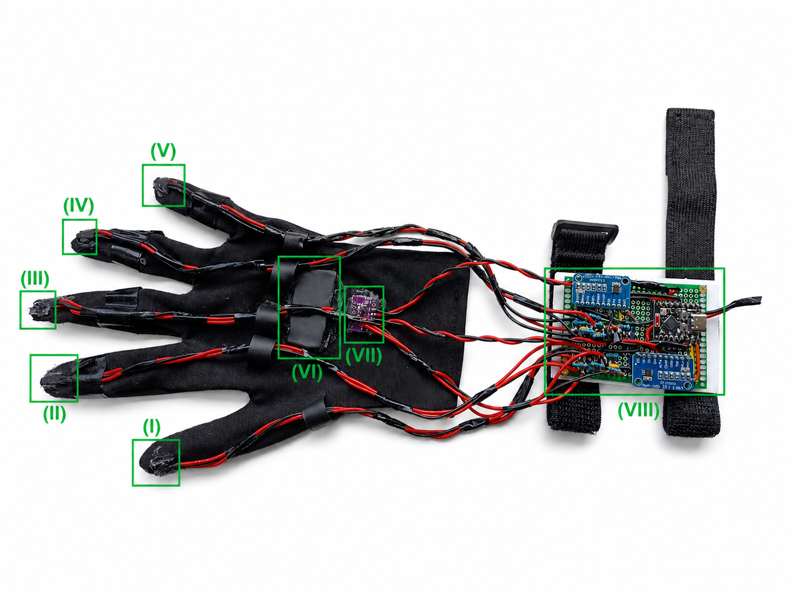
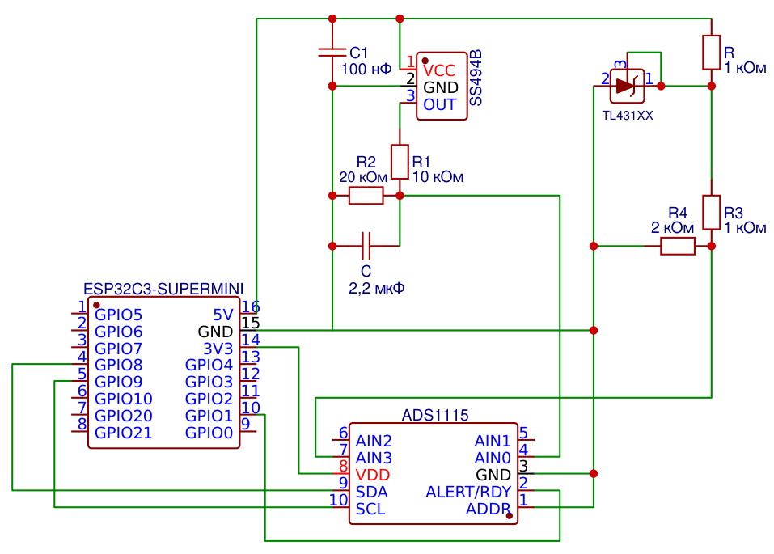
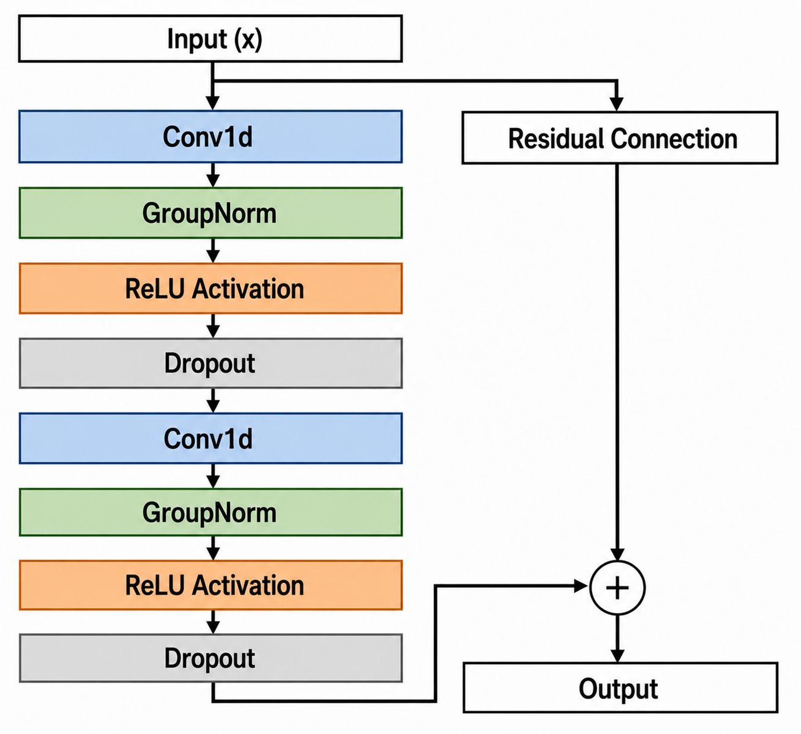
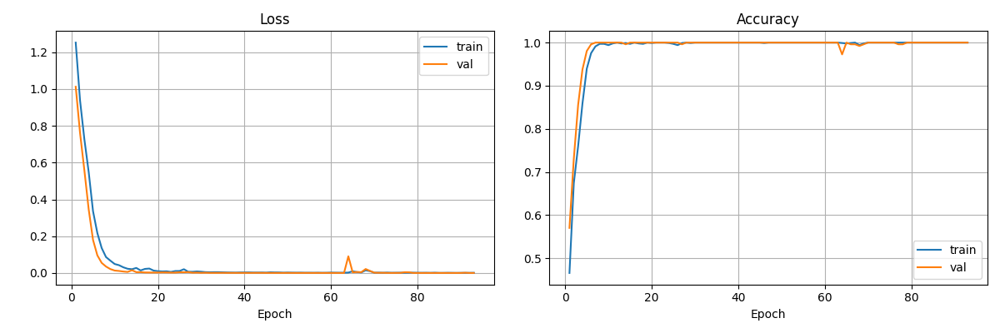

# Сенсорная перчатка для распознавания динамических жестов русского жестового языка

Разработка элементов аппаратно-программного комплекса для распознавания динамических жестов русского жестового языка (РЖЯ) на основе носимой сенсорной перчатки с последующим преобразованием распознанного жеста в аудиоречь.

Работа выполнена в рамках выпускной квалификационной работы бакалавра СПбГУ.

---

## Содержание

* [О проекте](#о-проекте)
* [Почему сенсорный подход?](#почему-сенсорный-подход)
* [Аппаратная архитектура](#аппаратная-архитектура)
* [Программное обеспечение](#программное-обеспечение)
* [Датасет](#датасет)
* [Нейросетевая модель](#нейросетевая-модель)
* [Результаты](#результаты)
* [Структура репозитория](#структура-репозитория)
* [Быстрый запуск](#быстрый-запуск)
* [Перспективы развития](#перспективы-развития)
* [Контакты](#контакты)

---

# О проекте

Основная цель проекта — разработка компактного аппаратно-программного комплекса, способного распознавать динамические жесты русского жестового языка и преобразовывать их в аудиоречь в режиме, близком к реальному времени.

В отличие от большинства существующих решений, использующих камеры или радиочастотные сенсоры, в данной работе выбран **носимый сенсорный подход**, основанный на сочетании линейных датчиков Холла и инерциального измерительного модуля (IMU).

Такой подход обеспечивает:

* независимость от освещения;
* устойчивость к изменению фона;
* отсутствие проблем с окклюзиями (когда одна рука перекрывает другую на кадре);
* сохранение конфиденциальности пользователя;
* возможность создания полностью автономного устройства.

---

## Почему сенсорный подход?

| Подход                              | Преимущества                                                                             | Ограничения                                                                        |
| ----------------------------------- | ---------------------------------------------------------------------------------------- | ---------------------------------------------------------------------------------- |
| Компьютерное зрение                 | Богатая информация (руки, лицо, поза), множество открытых датасетов                      | Зависимость от освещения, ракурса, фона, окклюзий, высокая вычислительная нагрузка |
| Радиочастотные системы              | Независимость от освещения, отсутствие камеры                                            | Высокий уровень шума, зависимость от окружающей среды, стационарность              |
| **Носимые сенсоры (данная работа)** | Работа в любых условиях, отсутствие окклюзий, приватность, возможность автономной работы | Необходимость ношения устройства                                                   |

---

## Аппаратная архитектура

### Состав измерительной системы

| Компонент | Назначение |
|-----------|------------|
| **5× датчиков Холла SS494B** | Измерение положения пальцев по изменению магнитного поля |
| **Неодимовый магнит N35 (40×20×4 мм)** | Создание магнитного поля для датчиков Холла |
| **Инерциальный модуль BMI160** | Измерение ускорений и угловых скоростей кисти |
| **16-битный АЦП ADS1115** | Высокоточное измерение сигналов датчиков Холла |
| **Источник опорного напряжения TL431XX** | Формирование стабильного опорного напряжения |
| **Микроконтроллер ESP32-C3 Super Mini** | Сбор данных и управление системой |

### Особенности аппаратной реализации

* датчики Холла расположены на тыльной стороне дистальных фаланг;
* магнит закреплен на тыльной стороне кисти;
* применяется псевдодифференциальное подключение ADS1115;
* используется встроенный PGA (Gain = 8);
* аналоговые RC-фильтры и фильтрация питания минимизируют шум измерительных каналов.

---

<p align="center">
  
</p>

<p align="center">
<b>Рис. 1.</b> Прототип разработанной сенсорной перчатки.
</p>

<p align="center">
  
</p>

<p align="center">
<b>Рис. 2.</b> Часть принципиальной схемы прототипа (без IMU, один датчик Холла и его обвязка).
</p>

---

## Программное обеспечение

Встроенное ПО разработано для микроконтроллера **ESP32-C3** с использованием **FreeRTOS**.

Архитектура включает две независимые задачи:

1. сбор данных с периодом **10 мс (100 Гц)**;
2. передача измерений по UART.

Обмен между задачами осуществляется через очередь сообщений FreeRTOS, что обеспечивает детерминированную работу системы.

### Определение ориентации

Для вычисления пространственной ориентации кисти используется модифицированный **фильтр Маджвика** без магнитометра.

На каждом шаге вычисляются четыре компоненты кватерниона ориентации.

### Автоматическое выделение жеста (автотриммер)

Перед подачей данных в нейросеть автоматически определяется активная часть записи.

Используются:

* L1-норма гироскопа;
* L1-норма акселерометра;
* угол отклонения, вычисленный по кватернионам;
* сглаживание;
* нормализация;
* взвешенная сумма полученных трех сигналов активности.

Автотриммер позволяет автоматически определить начало и конец жеста без участия пользователя.

---

## Датасет

Для обучения и оценки модели был сформирован собственный датасет динамических жестов русского жестового языка. Запись данных выполнялась с использованием разработанной сенсорной перчатки. Каждый пример представляет собой многоканальный временной ряд, содержащий показания датчиков Холла, инерциального измерительного модуля и рассчитанные кватернионы ориентации кисти.

### Общие характеристики

| Параметр                     | Значение                         |
| ---------------------------- | -------------------------------- |
| Количество примеров          | **1480**                         |
| Количество классов           | **4**                            |
| Количество участников        | **7**                            |
| Обучающая выборка            | **5 участников (1280 примеров)** |
| Независимая тестовая выборка | **2 участника (200 примеров)**   |

### Распознаваемые жесты

* «Привет»;
* «Пока»;
* «Как дела?»;
* «Спасибо»;

### Распределение примеров по участникам

| Участник  | Примеров на класс | Всего примеров | Использование            |
| --------- | ----------------: | -------------: | ------------------------ |
| №1        |                10 |             40 | Обучение                 |
| №2        |                10 |             40 | Обучение                 |
| №3        |               210 |            840 | Обучение                 |
| №4        |                60 |            240 | Обучение                 |
| №5        |                30 |            120 | Обучение                 |
| №6        |                30 |            120 | Независимое тестирование |
| №7        |                20 |             80 | Независимое тестирование |
| **Итого** |                 — |       **1480** | —                        |

### Предобработка

Перед обучением выполняются:

* автоматическая сегментация жеста;
* преобразование абсолютных кватернионов в относительные;
* стандартизация каждого канала;
* дополнение или обрезка до фиксированной длины окна;
* вычисление первых производных сигналов Холла.

Размер входного окна составляет **416 отсчётов (4.16 с)**.


## Нейросетевая модель

Для классификации используется **Temporal Convolutional Network (TCN)**.

### Входные признаки

Используются 16 каналов:

* 3 датчика Холла;
* 3 производные сигналов Холла;
* 3 оси акселерометра;
* 3 оси гироскопа;
* 4 относительных кватерниона.

### Архитектура

```
Input
   ↓
Conv1D Stem
   ↓
Residual TCN Blocks (от 1 до 3)
   ↓
Masked Global Pooling
   ↓
Linear + ReLU + Dropout
   ↓
Softmax (4 класса)
```

### Аугментация

Во время обучения используются:

* аддитивный гауссовский шум;
* случайный сдвиг сигналов Холла;
* случайный временной кроппинг;
* интерполяция временного ряда.

### Обучение

Использовались:

* AdamW;
* CrossEntropyLoss;
* WeightedRandomSampler;
* ранняя остановка (Early Stopping).

---

<p align="center">
  
</p>

<p align="center">
<b>Рис. 3.</b> Схема одного остаточного блока.
</p>

# Результаты

## Ключевые достижения

* снижение уровня шума измерительных каналов **более чем в 64 раза** относительно встроенного АЦП ESP32-C3;
* **IoU автотриммера равна 0.969**;
* ошибка определения начала жеста **менее 20 мс**;
* ошибка определения конца жеста **менее 36 мс**;
* **100% Accuracy** на валидационной выборке;
* **100% Accuracy** на человеко-независимом тестировании;
* время полного инференса (вместе с автотриммером) **менее 10 мс**.

---

## Сравнение конфигураций TCN

| Остаточных блоков | Параметров | Accuracy (без аугментации) | Accuracy (с аугментацией) |
| ----------------: | ---------: | -------------------------: | ------------------------: |
|                 1 |     10 180 |                     99.0 % |                    96.5 % |
|                 2 |     16 516 |                     92.0 % |                    98.5 % |
|             **3** | **22 852** |                 **99.5 %** |                 **100 %** |

Лучшая конфигурация включает **три остаточных блока** и использование аугментации данных.
<p align="center">
  
</p>

<p align="center">
<b>Рис. 4.</b> График обучения модели с тремя остаточными блоками.
</p>

## Качество автотриммера

| Метрика       | Значение    |
| ------------- | ----------- |
| IoU           | **0.969**   |
| Recall        | **0.988**   |
| Ошибка начала | **19.5 мс** |
| Ошибка конца  | **35.9 мс** |

---

# Структура репозитория

```
.
├── autotrimmer/      # алгоритм автоматической сегментации жестов
├── checkpoints/      # обученные веса нейросетевых моделей
├── dataset/          # набор данных
├── docs/             # ВКР, изображения, схемы
├── firmware/         # прошивка ESP32-C3
├── inference/        # инференс и распознавание жестов
├── libraries/        # библиотеки для прошивки
├── model/            # архитектура TCN и конфигурация модели
├── test/             # скрипты тестирования и оценки
├── train/            # обучение модели
└── README.md
```

---

# Быстрый запуск

1. Собрать аппаратную часть и загрузить прошивку на ESP32-C3.
2. Подключить устройство к компьютеру по USB.
3. Запустить программу инференса.
4. По первому нажатию Enter начнется запись жеста, по повторному нажатию система автоматически распознает его и озвучит результат.

---

# Перспективы развития

Дальнейшее развитие проекта предполагает:

* разработку собственной печатной платы;
* переход к полностью автономному носимому устройству;
* использование всех пяти пальцев в модели;
* применение двух синхронизированных перчаток;
* интеграцию модели в мобильное приложение;
* переход к непрерывному распознаванию жестовой речи;
* расширение словаря распознаваемых жестов;
* увеличение объема датасета;
* проведение испытаний с носителями русского жестового языка.

---

# Контакты

**Автор**

Денис Чумак

Санкт-Петербургский государственный университет

Выпускная квалификационная работа

---

# Цитирование

Все права защищены. Данный код предоставляется исключительно для ознакомления. Любое копирование, модификация, распространение, коммерческое использование, а также использование кода в научных статьях, публикациях и академических работах без предварительного письменного согласия автора категорически запрещены.
По всем вопросам использования обращайтесь к автору: denis.chumak.04@gmail.com
